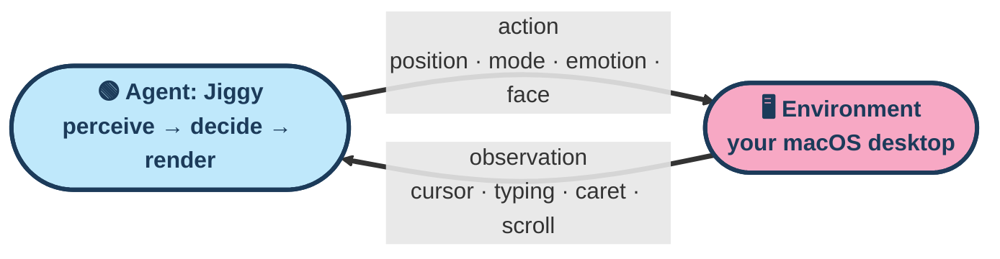
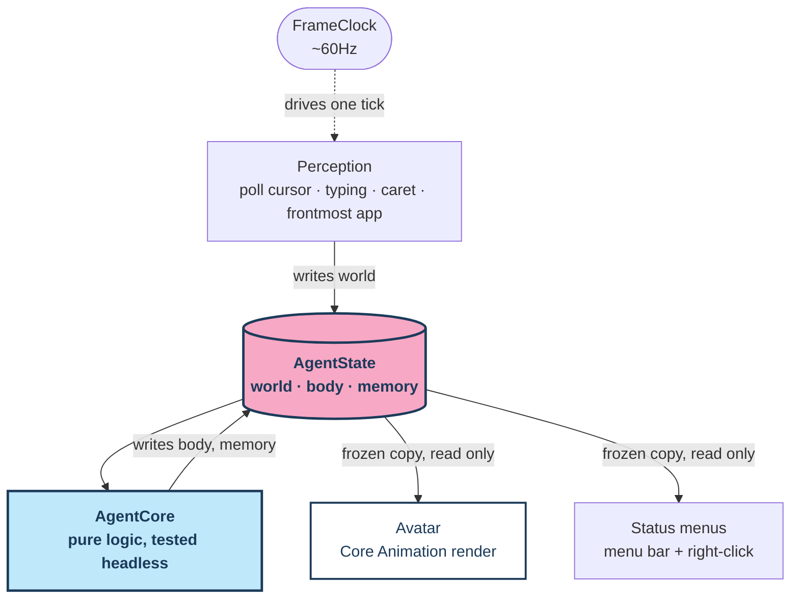
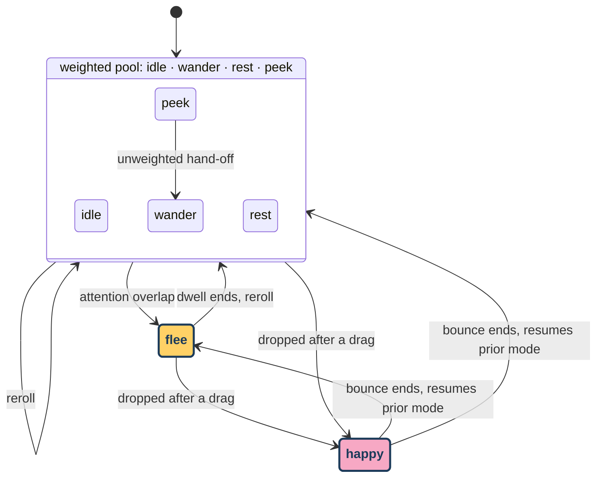

There is a small blue blob living on my desktop. It floats above every window, including
full-screen ones, on every virtual desktop. Left alone, it wanders, naps in a corner, or
peeks off the edge of the screen and comes back. Move the cursor too close and it gets
startled. Type for a while and it politely scoots out of the way of your caret. Pick it up
and it bounces happily when you let go.

That is Jiggy. It sounds like a toy, and it is one, but it is built like something meant to
last: a predictable, thoroughly tested behavior core underneath a thin rendering shell, at
about 12 MB of memory. This post is a tour of how it works today, the emotions it can show, and where the
project is headed next.

Eight faces, one per mood:

<table style="border:none; border-collapse:collapse; margin-left:auto; margin-right:auto;">
<tr>
<td style="border:none; padding:8px;"></td>
<td style="border:none; padding:8px;"></td>
<td style="border:none; padding:8px;"></td>
<td style="border:none; padding:8px;"></td>
</tr>
<tr>
<td style="border:none; padding:8px;"></td>
<td style="border:none; padding:8px;"></td>
<td style="border:none; padding:8px;"></td>
<td style="border:none; padding:8px;"></td>
</tr>
</table>

## How it works

*A frame clock drives Jiggy through the same loop that shows up in every reinforcement
learning textbook: an agent and an environment, passing an observation one way and an action
the other.*

That loop runs once per frame, around sixty times a second:

1. **Perceive.** Poll the cursor position, the frontmost app, whether the user is typing or
   scrolling, and (best effort) where the text caret is.
2. **Decide.** Feed those signals into a state machine that owns the agent's position, mode,
   and emotion.
3. **Render.** Draw the current frame: body squash, blinking eyes, a mouth, a speech bubble,
   a blush.

Right now the "decide" step is a fixed, hand-tuned state machine, not a learned policy. The
same seam is meant to carry a more intelligent decision step later, see "What is next" below.

## Design choices

A handful of decisions, more than any single feature, are why the rest of this holds
together:

- **`AgentState` is the one source of truth.** In the sense agent architectures use the word,
  it is the agent's memory: everything it carries from one frame into the next. It splits into
  three parts:
  - `world`: everything perceived from the outside, cursor position, typing, caret, frontmost app.
  - `body`: everything the agent decides about itself, position, mode, emotion.
  - `memory`: short-lived timers and cooldowns, the narrowest of the three, named for the same
    reason.

  Only one thing is allowed to write each part: perception writes `world`, the state machine
  writes `body` and `memory`.

- **Downstream, state is read-only.** The renderer and the status menus never touch the
  live `AgentState`, only a frozen copy taken once per frame.

- **Time and randomness as inputs.** Almost everything Jiggy does depends on time or
  chance: dwell timers decide when a mode ends, a weighted draw decides what comes next,
  blinking runs on its own random timer.

- **A pure logic core.** `AgentCore` is math and state transitions only: it defines and
  operates on `AgentState` directly, with no access to the screen, the mouse, or the display link.

- **Config.** Display name, bundle identifier, status glyph, and avatar choice come from
  `config.json` at launch, not hard-coded.

- **An avatar is just a type that implements `Avatar`.** A new avatar is one new
  implementation plus a one-line config change.

## Architecture

Same loop as above, now with the actual pieces named: perceive is `Perception`, decide is
`AgentCore` acting on `AgentState`, render is `Avatar`, plus the status menus reading that same
state. The native app splits cleanly into a logic layer and a shell layer, and the boundary is
enforced by what each layer is allowed to import.

- The one interaction that bypasses this flow is dragging: while the mouse button is down, the
  app delegate calls into the drag handlers directly, and the usual mode logic pauses until the
  drag ends.

## The state machine

- **The everyday modes run on randomness.** `idle`, `wander`, `rest`, and `peek` are chosen
  by weighted random draw whenever the current mode's dwell timer runs out, favoring sitting
  still over roaming (exact weights further below).
- **`happy` is triggered by a drag-and-drop.** It never comes up in the weighted draw. It only
  fires when a drag ends, holds for one quick bounce, then hands control back to whatever mode
  was active before the drag started.
- **`flee` is triggered by attention overlap.** It fires when the agent is sitting in the
  caret's buffer zone, or when the cursor makes contact with it while the user is actively
  typing or scrolling, so it stays out of the way while you are working (only typing and
  scrolling are tracked so far, not passive reading). The escape route isn't always right
  yet, see "Fixing known rough edges" below. Once the escape route completes, a short cooldown
  stops it from re-triggering every frame while the caret keeps moving nearby, and it rejoins
  the weighted pool exactly like any other mode.
- **`peek` does not get rerolled on return.** After peeking off an edge and lingering, it
  hands off directly to `wander` rather than going through the weighted draw again, the one
  exception to the reroll described above.

## Emotions and reactions

A mode decides where Jiggy goes. A separate concept, emotion, decides what its face looks
like while it gets there: it is an `Emotion` value (neutral, happy, curious, surprised,
sleepy, thinking, annoyed, or blush), and every mode simply maps to a base emotion. A
reaction is the drawn face for one emotion, the actual art the renderer produces for that
value. There are exactly eight reactions, one per emotion, exported straight from the same
geometry the renderer uses, shown at the top of this post.

<!--
| Mode | What it does | Chosen how often | Base emotion | How long it lasts |
|---|---|---|---|---|
| `idle` | Stands still, breathing | 50% of weighted draws | neutral | A few seconds |
| `wander` | Roams to a spot along the screen border | 20% | neutral | About the same as idle, a touch shorter |
| `rest` | Settles into a screen corner | 25% | sleepy | The longest stretch of the pool |
| `peek` | Slips toward a screen edge, lingers, then returns to wandering | 5% | curious | Brief, then hands off to wander |
| `happy` | A quick bounce after being picked up and dropped | never drawn, triggered by drag-drop | happy | Just a beat, then resumes whatever it was doing |
| `flee` | Scoots away from the text caret or a cursor that just touched it mid-typing | never drawn, triggered by attention overlap | surprised | About the same as an idle stretch |
-->

<table>
<thead>
  <tr>
    <th>Mode</th>
    <th>What it does</th>
    <th>Chosen how often</th>
    <th>Base emotion</th>
    <th>How long it lasts</th>
  </tr>
</thead>
<tbody>
  <tr>
    <td><code>idle</code></td>
    <td>Stands still, breathing</td>
    <td>50% of weighted draws</td>
    <td>neutral</td>
    <td>A few seconds</td>
  </tr>
  <tr>
    <td><code>wander</code></td>
    <td>Roams to a spot along the screen border</td>
    <td>20%</td>
    <td>neutral</td>
    <td>About the same as idle, a touch shorter</td>
  </tr>
  <tr>
    <td><code>rest</code></td>
    <td>Settles into a screen corner</td>
    <td>25%</td>
    <td>sleepy</td>
    <td>The longest stretch of the pool</td>
  </tr>
  <tr>
    <td><code>peek</code></td>
    <td>Slips toward a screen edge, lingers, then returns to wandering</td>
    <td>5%</td>
    <td>curious</td>
    <td>Brief, then hands off to wander</td>
  </tr>
  <tr>
    <td><code>happy</code></td>
    <td>A quick bounce after being picked up and dropped</td>
    <td>never drawn, triggered by drag-drop</td>
    <td>happy</td>
    <td>Just a beat, then resumes whatever it was doing</td>
  </tr>
  <tr>
    <td><code>flee</code></td>
    <td>Scoots away from the text caret or a cursor that just touched it mid-typing</td>
    <td>never drawn, triggered by attention overlap</td>
    <td>surprised</td>
    <td>About the same as an idle stretch</td>
  </tr>
</tbody>
</table>

The weights favor sitting still, which is a deliberate choice: a desktop agent that is always
in motion reads as busy and distracting rather than alive. Wandering and resting exist to
give it somewhere to go and something to do while you are not looking, and peeking is rare
enough to feel like a small surprise rather than a tic.

## Current features

- **Autonomous roaming.** Idle, wander, rest, and peek, chosen by weighted random draw, so it
  rarely settles into an obvious pattern.
- **Drag and drop.** Pick it up, move it anywhere on screen, and it bounces happily when you
  let go.
- **Blinking.** Randomized on its own timer, independent of mode or emotion.
- **Idle quirks and proximity startle.** Small unscripted moments of personality while it
  sits still: an occasional blush, a thinking pause, a flash of annoyance, or a startle when
  the cursor strays too close.
- **Attention-aware movement.** The newest piece of the brain, tracking where the user is
  typing via the Accessibility API (once granted). The buffer-zone avoidance is covered under
  `flee` above; it also feeds into where the agent chooses to wander, rest, or peek next,
  leaning toward whichever edge or corner is farthest from wherever the user is currently
  working, a polite bias rather than a hard rule.
- **A true overlay window.** Floats above everything, including full-screen apps, on every
  virtual desktop. Only the avatar's body is clickable, so nothing underneath is ever blocked,
  and it never steals focus or activates itself when clicked.
- **Menu bar presence, no Dock icon.** A quiet status item with a live-updating dropdown, plus
  a matching right-click menu on the avatar itself, both built from the same live status data
  so neither one can drift out of sync with the other.
- **Launch at login**, plus the config-driven branding covered above: nothing about identity
  is hard-coded.

## What is next

Jiggy today does not see what is inside the windows it floats over, does not talk, and does
not use any AI or LLM smarts. It also only comes in one look. All of that is deliberate scope
for now, not a ceiling. A few directions the project is heading:

- **More emergent movement.** The attention-avoidance brain described above is the first
  piece of behavior that goes beyond the original roam-and-react logic: instead of just
  reacting to proximity, it now has a notion of where the user's attention is and steers
  around it. The natural next step is layering in more of these small, local rules (reacting
  to which app is frontmost, to window layout, to time of day) and seeing what kind of
  personality emerges from the combination, rather than scripting bigger behaviors by hand.
- **Improving the state machine itself.** The mode weights, the flee/happy triggers, and the
  diagrams describing them above are an early pass. As more perception signals come online,
  the plan is to revisit the state machine as a whole, not just stack new triggers on top of
  it.
- **Making it useful, not just charming.** The state object already carries a notion of the
  frontmost window and its bounds, currently populated on a best-effort basis and unused
  beyond rendering. That is a deliberate seam for a future where Jiggy actually notices what
  you are working on and reacts to it meaningfully, not just to cursor position.
- **LLM capabilities.** The entire state object, world, body, and memory, was designed from
  the start to double as a context object an LLM could reason over: it is plain, human- and
  machine-readable JSON under the hood. Nothing consumes it that way yet, but the shape is
  already there.
- **Voice: TTS and STT.** Giving Jiggy a voice, and the ability to understand one, is on the
  roadmap once the LLM layer exists to give it something worth saying.
- **More than one look.** The slime is the only avatar today. The `Avatar` seam covered above
  already makes adding a second one cheap. The open question is what to add, not how.
- **Planning training data collection.** Any future move from a hand-tuned state
  machine to a learned policy needs data to train on. That means figuring out what to log
  (cursor and caret traces, mode transitions, timing, outcomes), how to collect it without
  being invasive, and how that maps to a training approach, most likely reinforcement
  learning over the movement and emotion decisions the state machine makes today.
- **Fixing known rough edges.** Typing detection does not currently register inside
  every terminal application, and there are still scenarios where the attention-avoidance
  brain's escape route moves it toward the cursor rather than away.

## Closing thoughts

Jiggy started as an Electron proof of concept. It proved the idea, then became the reason
for the native rewrite: measured side by side on the same machine, idle at the desktop, the
Electron POC's four processes added up to roughly 226 MB, over half of it the GPU compositor
process alone, the cost of a full browser engine for what is, visually, a small animated
shape. The native Swift/AppKit build that this post describes runs the same behavior at
roughly 12 MB, about 18 times lighter.

None of what makes Jiggy interesting today is the slime shape or the speech bubbles. It is
that a desktop agent this small can also be this disciplined: a single source of truth for
its state, one writer per piece of that state, a clock and a random source you can fake in a
test, and a render layer that only ever reads. That discipline is what makes an ambitious
roadmap, seeing what is on screen, reasoning about it, talking about it, actually tractable
instead of a pile of special cases bolted onto a blob that wanders around your screen.
