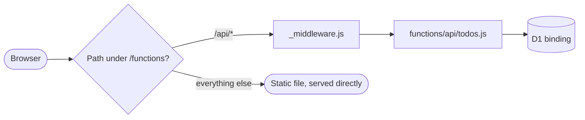
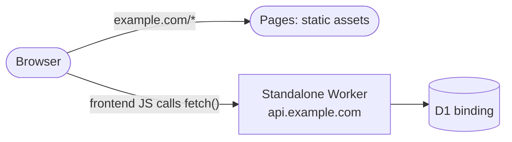
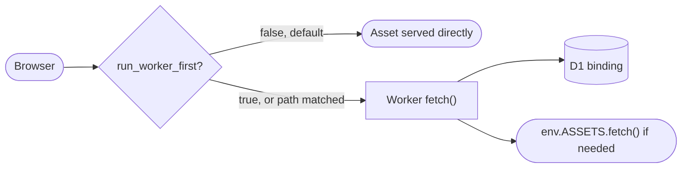

Cloudflare gives you three real ways to ship a full-stack CRUD app: [Pages](https://developers.cloudflare.com/pages/) with [Functions](https://developers.cloudflare.com/pages/functions/), Pages with a standalone [Worker](https://developers.cloudflare.com/workers/), and Workers with [static assets](https://developers.cloudflare.com/workers/static-assets/). They look similar but differ in routing and auth, in where your code lives and when it runs.

I was building [Class of One]() when I faced this confusion. After resolving the confusion with the help of Claude, I wanted to document it for future reference.

TL;DR: for a new full-stack app in 2026, go for **Workers with static assets**. It is Cloudflare's own recommended default, unifies the frontend and backend into one deployment, and is the cleanest answer to "how do I put my static file behind auth." Pages remains fully supported. If you already have a happy Pages project, there is no deadline forcing you off it.

## Mode 1: Pages with Functions

A Pages project with a `functions/` directory next to your built site. Each file becomes a route by its path:

- `functions/api/todos.js` handles `/api/todos`
- `functions/api/todos/[id].js` handles `/api/todos/123`

A [`_middleware.js`](https://developers.cloudflare.com/pages/functions/middleware/) file in any directory runs before the handlers, the natural place for auth checks, logging, or CORS.



**Pros**

- Zero-config file-based routing, so a small CRUD API reads like a folder tree instead of a router table. Fastest path from "I have a static site" to "I have an API."

**Cons**

- Routing conventions become awkward once the API grows past a handful of simple routes (dynamic segments, catch-alls, and custom method dispatch all have their own file naming rules to learn).
- Static assets bypass `_middleware.js` entirely, so gating a static file needs a workaround. More on this in the auth section.

## Mode 2: Pages with a standalone Worker

Two independent Cloudflare projects, deployed separately.

1. Pages serves the static frontend on its own domain, for example a `pages.dev` subdomain or a custom domain like `example.com`.
2. The API lives in its own Worker project with its own domain, for example a `workers.dev` subdomain or a custom domain like `api.example.com`.

Two separate domains, not just two separate projects, that's what makes this cross-origin. The frontend's client-side JS calls the API's URL directly.



**Pros**

- True independence: separate deploys, separate scaling, separate rollback history for frontend and API.
- The same API can back more than one frontend (a mobile app, another site) since it isn't tied to a specific Pages project.

**Cons**

- Cross-origin by default, with the cookie and CORS handling landing entirely on you.
- No shared request pipeline, so the Worker never sees requests for the Pages site's static files, it can't gate them.
- Two dashboards, two deploy pipelines, two things that can drift out of sync with each other.

## Mode 3: Workers with static assets

A Worker project where the [`wrangler`](https://developers.cloudflare.com/workers/wrangler/) config points at your frontend, and the API routes. By default, requests that match a static file are served directly without invoking the Worker. This is the fast path. You can customize this behavior with [`run_worker_first`](https://developers.cloudflare.com/workers/static-assets/routing/) config.



**Pros**

- One deployment for frontend and backend, no split between a Pages project and a separate Worker to keep in sync.
- `run_worker_first` gives you a first-class, explicit switch for which paths must go through your code, including protected static pages.
- Cloudflare's recommended default for new full-stack projects.

**Cons**

- No zero-config file-based routing, you write the router.
- Slightly more setup than dropping files into a `functions/` folder if all you need is two or three simple endpoints.

## Auth Layers

Auth on Cloudflare splits into three layers:

1. **Platform-level: [Cloudflare Access](https://developers.cloudflare.com/cloudflare-one/policies/access/).** Zero Trust sits in front of all three modes identically. It checks identity at the edge before any of your code or assets run, so if you put a route behind Access, the deployment mode underneath is irrelevant. This is the right tool for internal tools and admin panels where "logged in via SSO" is the whole requirement.

    ```mermaid
    flowchart LR
        Browser(["Browser"]) --> Access{"Cloudflare Access:<br/>identity check"}
        Access -->|denied| Login(["Redirect to SSO login"])
        Access -->|allowed| App(["Your app<br/>(any deployment mode)"])

        class Login bad
        class App good
    ```

2. **App-level: session or JWT checks.** This is where your own code decides who is allowed to call the API. What differs is where you call it:

    - `_middleware.js` in Pages Functions
    - the top of the `fetch` handler in the standalone Worker
    - the top of the `fetch` handler in Workers with static assets

    ```mermaid
    flowchart LR
        Browser(["Browser"]) --> Type{"Static asset or API route?"}
        Type -->|static asset| Bypass(["Served directly, no auth check"])
        Type -->|API route| Check{"requireAuth(request, env)"}
        Check -->|no valid session| Reject(["401 Unauthorized"])
        Check -->|valid session| Route(["Your route/handler logic"])

        class Bypass bad
        class Reject bad
        class Route good
    ```

    Note that in this layer, static assets are not behind any auth (the top branch).

3. **Static-asset gating, the actual differentiator.** By default, all the modes serve static
files without running your auth check at all, because the fast path is designed to skip your
code. A naive `_middleware.js` or `fetch` handler auth check never even sees a request for a
protected HTML page or PDF, the CDN answers it first. How each mode lets you close that gap:

    - **Pages Functions.** `_middleware.js` only intercepts requests that fall under `functions/`. Static files never pass through it. To gate a static file, serve it *through* a Function (read the file as an asset binding and return it after the auth check).

    - **Pages with a standalone Worker.** This makes things more complex, but there are two ways:
        - Add a `functions/` directory to Pages to gate the static asset, same as the bullet above.
        - If you've deliberately kept the Pages project pure static with no Functions at all, then moving the file into the Worker's own storage and serving it as a gated endpoint is the only way.

    - **Workers with static assets.** Set `run_worker_first` to `true` (or scope it to specific routes) so your code runs before the asset would otherwise be served, then have it decide per-path whether to check auth or just call `env.ASSETS.fetch()` untouched.

## Conclusion

For a new full-stack CRUD app, start with Workers and static assets: one deployment, the full Cloudflare developer platform, and `run_worker_first` as an honest, explicit answer to gating static content. If you already have a Pages project that works, there's no reason to migrate it, Pages is fully supported as of today. Reach for Pages with a standalone Worker when the API genuinely needs to stand on its own, serving more than one frontend, or shipping on its own release schedule, and you're willing to own CORS and give up any way to gate Pages' static files from the Worker itself.
